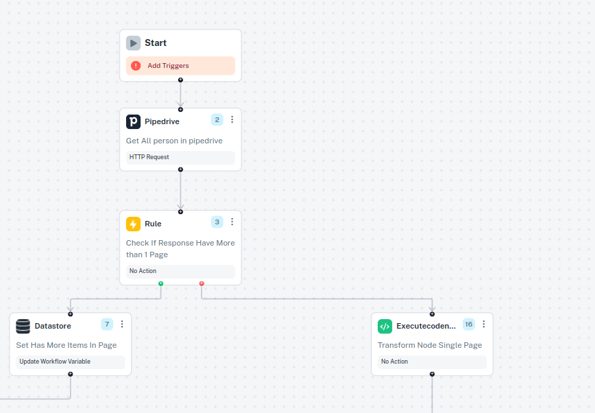
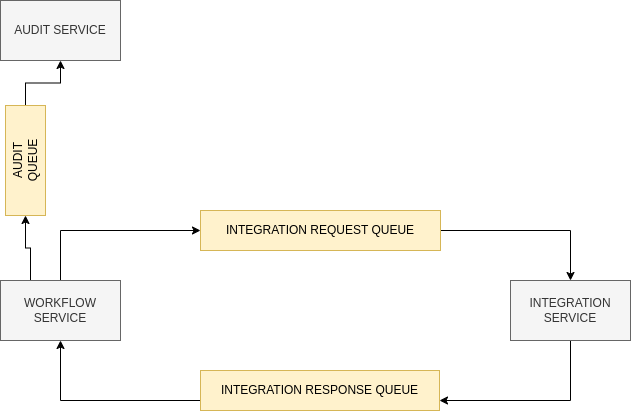

## Introduction

In cobalt we currently run 5 Services.

1. Auth Service : This service is responsible for managing Authentication Tokens and also handing 3rd part Authentication.
2. Integration Service: This is service is responsible for making 3rd party API calls, such as pipedrive slack etc.
Here we build methods, either via direct API integrations or using SDKs and expose them for other service to consume.
3. Audit Service: All Events that happen in our platform, are logged in this service.
4. Workflow Service: This service is responsible for building workflows, executing them, checking their completeion status. Also applications client Id, secret are managed here.
5. QueueMonitoring Service: A monitoring service, where we monitor all Message Queues that we use.

**Tech stack**: nodejs,express,MongoDB,BullMQ

### The crux, workflows.

Each worklow is represented as a tree data structure with Nodes Representing an action.

Caption: A simple Tree Structure

**The General Algorithm of Execution**

The Workflow is executed in a breadth first search fashion starting from the start node. 

Only the connected nodes from start node are executed.

Each Node has `status` property assigned to it by default nodes are in `Ready` state.

Once the node has been enqueued, we set the status as `Waiting`

The enqueued job, is processed by Integration service. It receives job from `Integration-Request Queue` once processing is complete, we enqueue response to `Integration-Response Queue` which is again picked up by workflow service. (We handle the retries, in case job processing fails, 3 times with incrementing exponential backoff)

The workflow service sets the status of Node as `Completed` or `Errored` based on response received from the integration service. 

Regardless of the response received, we check status of all connected nodes from start, if all nodes are `Completed` workflow is marked completed. 

Caption: High Level Diagram of Architecture